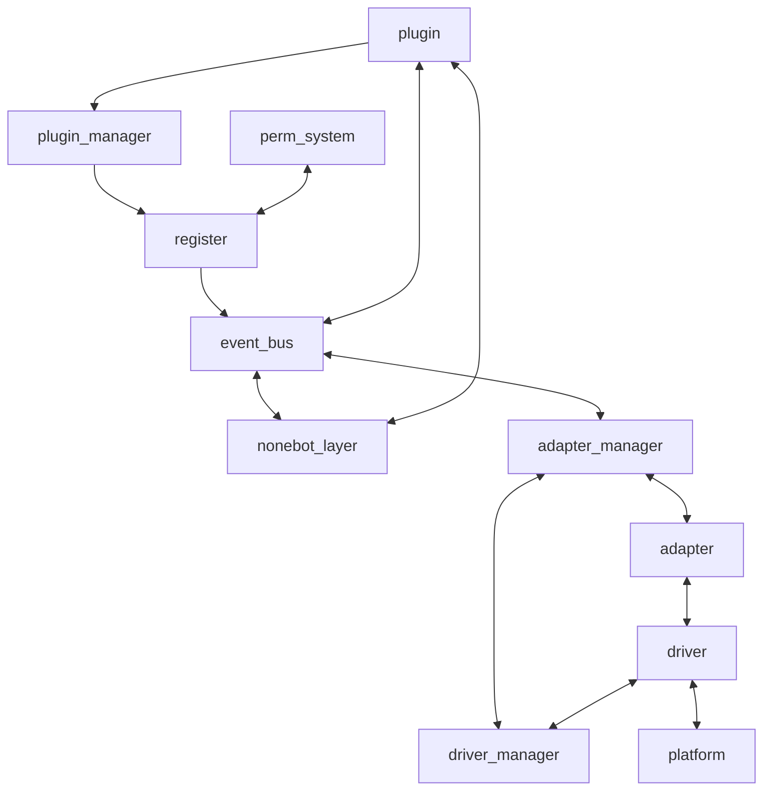
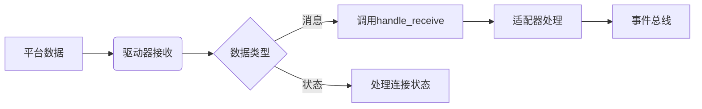

# Coral - Developer Manual

这里是 Coral 开发手册。本文面向对 Coral 框架进行开发，并希望为 Coral 贡献代码的用户。

> 目前，Coral 还处于开发阶段，API 可能会发生变化。

Coral 框架使用 Python 3.10 开发，在 Python 3.10+ 环境下运行，请确保你的开发环境满足要求。

## 你必须知道的

> [!important]
> 在贡献代码之前，请确保你已经阅读并了解了 [Contributing](docs/CONTRIBUTING.md) 文档。

Coral 框架是一个基于事件驱动的异步框架，它使用event_bus模块来管理事件，并使用asyncio模块来处理并发请求。

其架构设计参考了 Nonebot2 的架构，但也有自己的特色。

主要结构：

- event_bus: 事件总线，用于管理事件，并触发事件。
- plugin_manager: 插件管理器，用于管理插件。
- register: 注册插件，将插件注册到插件管理器中。
- nonebot_layer:  nonebot2 兼容层，用于强（行）兼（容）类 nonebot2 插件。
- perm_system: 权限系统，用于管理权限。
- adapter_manager: 适配器管理器，用于管理适配器。
- driver_manager: 驱动管理器，用于管理驱动。

> 如果你要开发插件，请阅读 [插件开发指南](DevManual/PluginDev.md)。

## 编写文档

如果你想为 Coral 编写文档，请确保遵循以下规范：

- 文档文件名必须以 `.md` 结尾，文档标题必须以 `#` 开头。
- 文档内容必须使用 Markdown 语法。
- 应尽量简洁明了，避免过多的图表和复杂的示例。
- 一个文档应只涉及一个主题，避免过多的篇幅。
- 文档应包含必要的链接，以便于用户快速了解相关信息。

在完成文档后，请提交一个 PR 到 `dev` 分支，标题格式应为 `docs(xxx): 添加 xxx 文档` 。

## 开发适配器和驱动器

Coral 依赖于适配器和驱动器来与不同平台进行交互。

### 数据处理流程

### 适配器

适配器用于实现与平台的交互，它负责将平台消息转换为 Coral 框架的事件，并将事件转换为平台消息。

适配器应该是唯一的，每个适配器应只适配一种协议，例如 QQ 协议、Telegram 协议等。

适配器应继承于 `core.adapter.BaseAdapter` 类。

详细的适配器开发指南请参考 [适配器开发指南](DevManual/AdapterDev.md)。

### 驱动器

驱动器用于实现与平台的通信，它负责与平台建立连接，并接收和发送消息。

驱动器的协议应该是可复用的，每个驱动器应只负责一种平台，例如HTTP 驱动器、WebSocket 驱动器等。

驱动器应继承于 `core.driver.BaseDriver` 类。

详细的驱动器开发指南请参考 [驱动器开发指南](DevManual/DriverDev.md)。

## 贡献核心代码

如果你想为 Coral 贡献核心代码，请确保遵循以下规范：

- 请不要提交过于复杂的功能，保持简单易懂。
- 至少确保你的代码通过测试。
- 不要出现类循环依赖，例如 A 中的某个函数依赖 B，而 B 依赖 A。
- 禁止与具体的平台直接关联，这会damage框架的可移植性。
